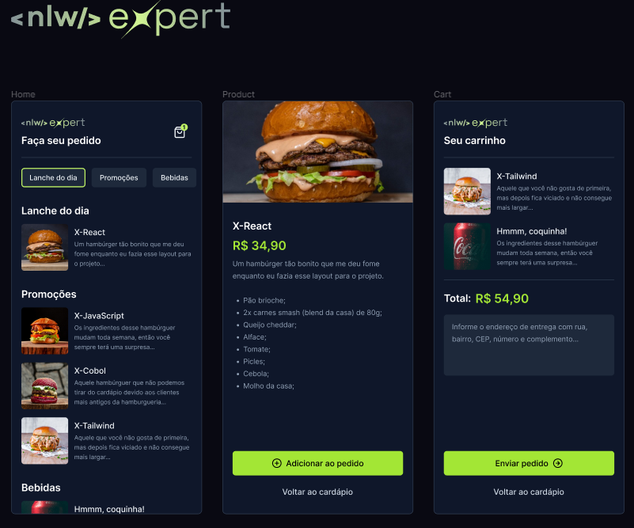

## 🍔📱 Projeto: Delivery de Lanches
Este é um aplicativo mobile desenvolvido durante a NLW Expert da Rocketseat. Com este aplicativo, os usuários podem:
- Explorar um cardápio completo, organizado por categoria.
- Visualizar os detalhes de cada item do cardápio.
- Adicionar ou remover itens do carrinho de compras.
- Finalizar o pedido, enviando-o diretamente pelo WhatsA

## 🛠️ Tecnologias e Ferramentas Utilizadas

- [React Native](https://reactnative.dev/)
- [Expo](https://expo.dev/)
- [TypeScript](https://www.typescriptlang.org/)
- [React Navigation](https://reactnavigation.org/)
- [react-native-safe-area-context](https://github.com/th3rdwave/react-native-safe-area-context) - Contexto de área segura para React Native.
- [React Native Screens](https://github.com/software-mansion/react-native-screens) - Biblioteca para melhorias de desempenho de navegação em React Native.
- [React Native AsyncStorage](https://docs.expo.dev/versions/latest/sdk/async-storage/) - API para armazenamento de dados persistentes em aplicativos React Native.
- [clsx](https://www.npmjs.com/package/clsx) - Utilitário para geração de strings de classe condicional em JavaScript.
- [NativeWind](https://www.nativewind.dev) - Framework para desenvolvimento de interfaces de usuário React Native com estilo inspirado no Tailwind CSS.
- [Zustand](https://zustand-demo.pmnd.rs) - Biblioteca de gerenciamento de estado React que permite criar estado de forma simples e poderosa.
- [WhatsApp API](https://faq.whatsapp.com/5913398998672934/) - Interface de programação de aplicativos que permite a integração de aplicativos com o WhatsApp para envio de mensagens e comunicação.

## 📝 Licença
Esse projeto está sob a licença **MIT**. Veja o arquivo [LICENSE](LICENSE) para mais detalhes.